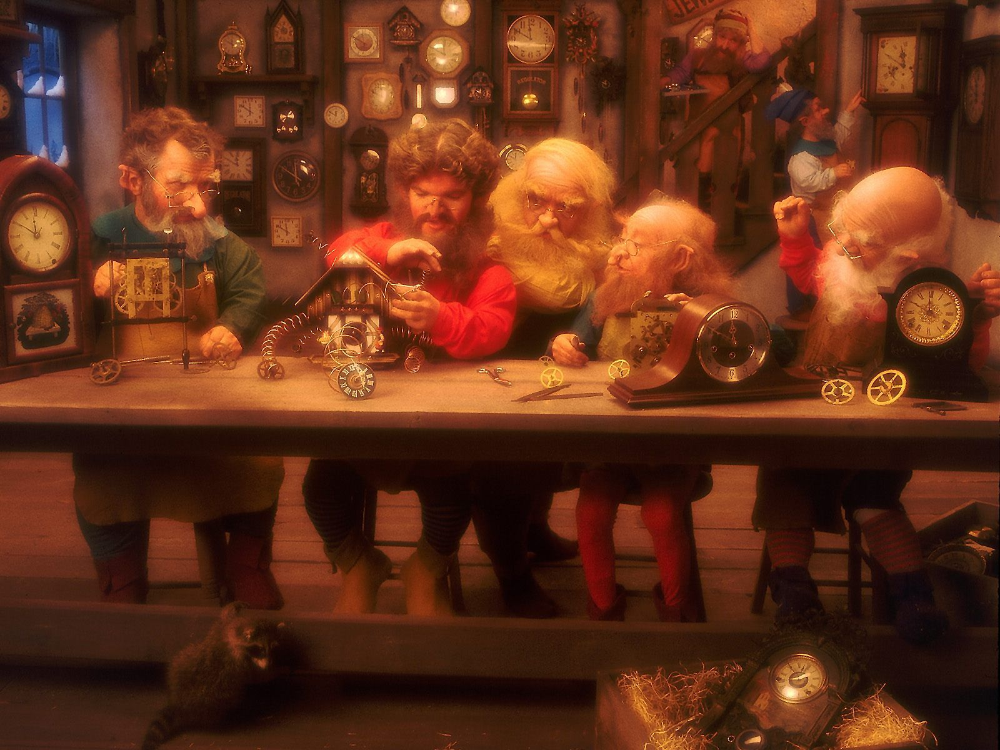

---

layout: sc5

style: |

    #Cover h2 {
        margin:30px 0 0;
        color:#FFF;
        text-align:center;
        font-size:70px;
        }
    #Cover p {
        margin:10px 0 0;
        text-align:center;
        color:#FFF;
        font-style:italic;
        font-size:20px;
        }
        #Cover p a {
            color:#FFF;
            }
    #Picture h2 {
        color:#FFF;
        }
    #SeeMore h2 {
        font-size:100px
        }
    #SeeMore img {
        width:0.72em;
        height:0.72em;
        }
---

# BEM CSS Workshop {#Cover}

*Brought you by [Varya Stepanova](http://varya.me) and generated by [Jekyller](https://github.com/shower/jekyller)*

<!-- photo by John Carey, fiftyfootshadows.net -->

##Is this good?

    H1 { color: blue }
    P EM { font-weight: bold }
    A:link IMG { border: 2px solid blue }
    A:visited IMG { border: 2px solid red }
    A:active IMG { border: 2px solid lime }

<!--
Now look at this code. Do you see something strange? Any guess?
Who would write their CSS like this?

The problem is that CSS was created to make text bold and links underlined. It ideally suited
solving these problems. In many websites developers still use CSS like.

Actually this code from [CSS level 1 specification](http://www.w3.org/TR/CSS1/). It is
very simple, was recommended in 1996. Time passed and we met new chalenges.
-->

## What makes CSS hard?

* Vertical centering
* Equal height columns
* Browser inconsistencies
* Unobvious tricks
{: .next }

<!--
Before we decide what is wrong with that peice, let's guess what is hard in CSS.

When ppl are asked, the repson is usually
- vertical centing
- making columns of equial height
- browers render CSS differently, so it takes special knowledge and work to make the interface consistent
- many solutions are unobvious tricks which needed to be memorized

But this is not true, this is easy or at least clear how to manage. You can google for all this questions.
-->

## What <b>really</b> makes CSS hard?

* Scoping
* Specificity conflicts
* Non-deterministic matches
* Dependency management
* Removing unused code

<!--
The real hard problems of CSS are here:
- No scoping. Everything is CSS is global.
- Specificity conflicts. I'll explain in detal later.
- Non-deterministic matches which naturally result from declarativeness of CSS language
- Dependency management
- Removing unused code
-->

## Theory

    .BLOCK{__ELEMENT[--MODIFIER]}

## Just a button

    <button class="button">Button button</button>
    Span button
    <a class="button" href="#">Link button</a>

<button class="button">Button button</button>
Span button
<a class="button" href="#">Link button</a>

## Selected button (modifier)

    <button class="button">Button</button>
    <button class="button button--selected">
      Selected button</button>

<button class="button">Button</button>
<button class="button button--selected">
  Selected button</button>

    $element.addClass('button--selected')

## Theme

    <button class="button">Button</button>
    <button class="button button--brand">Brand button</button>
    <button class="button button--brand button--selected">
      Selected brand button</button>

<button class="button">Button</button>
<button class="button button--brand">Brand button</button>
<button class="button button--brand button--selected">
  Selected brand button</button>

## Another theme

    <button class="button">Button</button>
    <button class="button button--night">Night button</button>
    <button class="button button--night button--selected">
      Selected night button</button>

<button class="button">Button</button>
<button class="button button--night">Night button</button>
<button class="button button--night button--selected">
  Selected night button</button>

## State as a modifier

    <button class="button">Button</button>
    <button class="button button--process">
      Doing smth button</button>

<button class="button">Button</button>
<button class="button button--process">Doing smth button</button>

    $element.toggleClass('button--process')

## Combine modifiers

    <button class="button button--brand button--process">
        Doing smth brand button</button>

<button class="button button--brand button--process">
    Doing smth brand button</button>

<button class="button button--night button--process">
    Doing smth brand button</button>

## SASS syntax

    .block
      prop: val

      &--mod
        prop: val

      &__elem
        prop: val

        &--mod
          prop: val

<!-- TODO: Show how it results -->

## Working example

## MindBEMding :-)

    $text__family-sans: "Proxima Nova", "Helvetica Neue", Helvetica, Arial, sans-serif;
    $text__size--beta: 30;
    $text__line--beta: 36;

    $text__colour--base: $color__neutral--dark;
    $text__colour--alpha: $color__primary;
    $text__colour--beta: $color__primary;

## Scalability

## File structure

## Multilingual structure

## Logic

## Libraries
